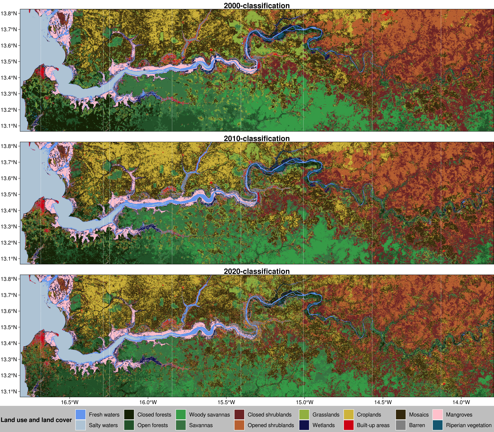
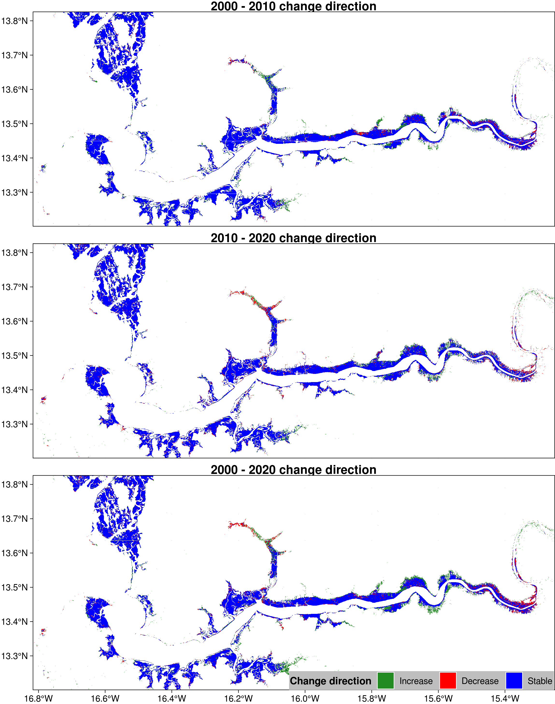

\begin{abstract}

Gambia, relative to its size, has an extensive mangrove cover along its cost. This unique vegetation serves numerous roles. It is the source of edible products sourcing (e.g., shellfishing) for thousands of households living close to the water systems. The vegetation is also the source of wood for energy, construction and other household utensils and farm materials. Of late, there is a lot ongoing in the mangrove ecosystems and the spatial coverage of this vegetation type has been oscillating between gains and losses. A proper account of change magnitude and where the changes have been happening is not widely studied. In some case, the methods deployed even may have uncertainties that made the estimates to vary between studies. We estimated the spatial-temporal dynamics of mangrove between 2000 and 2020. We used 2,916 Landsat and 959 MODIS tiles (used for filling gaps in Landsat data) of land surface reflectance data spread across 3 bands (i.e., visible red, near infrared and shortest wave infrared) acquired between the years 2000 and 2020. The atmospherically corrected Landsat and MODIS surface reflectance provide reasonable estimates of target reflectance as it would be measured on the ground, making them good candidates for land use and land cover analysis. A classification accuracy of 0.97 and above was achieved both for the overall accuracy and Kappa coefficient. The results revealed that mangroves in The Gambia made net gains over the time period considered. Mangroves, in general, made a significant gain with a net area gain of about 7,784 ha over the 20 years period. The total area gain of mangroves in the period was about 11,951 ha (with almost 598 ha per year). During the same period, the loss in the existing mangrove vegetation area was estimated to be 4,167 ha with an estimated annual loss of about 208 ha. This observed recovery of the mangrove extent could largely be attributed to growing awareness about the importance of this vegetation type for coastal area resilience and the livelihoods of thousands who depend on it. We, however, want to note that the observed net gains should not mask the ongoing degradation of mangroves in other parts of the country. With the losses of such, the damage to livelihoods and biodiversity such as fish and marine life is significant. There still needs a strong push for minimizing the losses being recorded and invest in restoring those areas that are devoid of the vegetation already. 

%All article types: you may provide up to 8 keywords; at least 5 are mandatory.
\tiny
 \keyFont{ \section{Keywords:} Satellite image time series; Landsat data; Land cover classification; Change detection; Mangrove; Google Earth Engine } 

\end{abstract}


```{r Setting-the-Scene, echo=FALSE, cache=FALSE, include=FALSE}
set.seed(123)

if (!require("remotes")) {
  install.packages("remotes")
}
if (!require("rgee")) {
  remotes::install_github("r-spatial/rgee")
}
if(!require("tinytex")) {
  install.packages("tinytex")
  tinytex::install_tinytex()
}
## loading required packages ####
if (!require("pacman")) install.packages("pacman")
pacman::p_load(
  googledrive,
  googleCloudStorageR,
  rgee,
  tidyverse,
  grid,
  gridExtra,
  rgdal,
  raster,
  sf,
  ggspatial,
  kableExtra
)

ksource <- function(x, ...) {
  source(purl(x, output = tempfile()), ...)
}

## Should local files with the same name be overwritten?
overwrite_file = TRUE

# Initialize Earth Engine, GD and GCS
# # https://github.com/r-spatial/rgee/issues/99#issuecomment-696341866
# library(reticulate); library(rgee)
# 
# # 1. Terminate your are R session
# # 2. Install miniconda
# # install_miniconda() 
# # 3. Set your miniconda Python Env
# use_python("PUT_HERE_THE_PYTHON_PATH_THAT_MINICONDA_CREATE")
# # 4. Run ee_install()
# ee_install()
# options(gargle_quiet = FALSE)
# drive_auth()
ee_Initialize(user = 'issoufoul@gmail.com', drive = TRUE, gcs = FALSE)
# ee_Initialize(email = params$email, drive = params$drive, gcs = params$gcs)

dir.create(file.path('source_files'))
dir.create(file.path('source_files/ee'))
dir.create(file.path('source_files/r'))
dir.create(file.path('ee_output'))
source('source_files/ee/01_commonSpecs.R')
source('source_files/ee/02_functions.R')

gplot_data <- function(x, maxpixels=ncell(x),...){
  if (maxpixels < ncell(x)){
    x <- sampleRegular(x, size = maxpixels, asRaster=TRUE)
  }
  coords <- xyFromCell(x, seq_len(ncell(x)))
  dat <- stack(as.data.frame(getValues(x)))
  names(dat) <- c('value', 'variable')
  
  dat <- cbind(coords, dat)
}
```

```{r ee-compute-01-unsupervised-classifications,include=FALSE,echo=FALSE,cache=FALSE}
# Compute and save an unsupervised classification 
##################/ Classification 2018 - 2020  ###################

filteredLandsat =  collectLansatImages ('LSR', roiGambia, 2018, 2020, ee$List$sequence(1, 12), nDays, TRUE);

filteredLandsat = ee$ImageCollection(filteredLandsat);

### Gambia - NDVI 2018 - 2020 

# Some fixed variable for easy maintenance
NDVITargetBand = ee$List(list('NDVI_filled', 'NDWI_filled'));
NDVITargetBandRenamed = ee$List(list('NDVI', 'NDWI')); 

filledHarmonic = harmonic_fill(filteredLandsat, NDVITargetBandRenamed, harmonics);

fittedHarmonic = harmonic_fit(filledHarmonic, NDVITargetBand, harmonics, lagDays);

bandSeries = ee$Image(
  fittedHarmonic$select(list('NDVI_filled_fitted', 'NDWI_filled_fitted'))$toBands()
);

unsupervisedPrzt = unsuperClassifyThis(bandSeries, nClass, AgScale, roiGambia, 4, 1000)$rename('unsupervisedRaw');

##################/ Classification 2010 - 2012  ###################

filteredLandsat =  collectLansatImages ('LSR', roiGambia, 2010, 2012, ee$List$sequence(1, 12), nDays, TRUE);

filteredLandsat = ee$ImageCollection(filteredLandsat);

### Gambia - NDVI 2010 - 2012 

# Some fixed variable for easy maintenance
NDVITargetBand = ee$List(list('NDVI_filled', 'NDWI_filled'));
NDVITargetBandRenamed = ee$List(list('NDVI', 'NDWI')); 

filledHarmonic = harmonic_fill(filteredLandsat, NDVITargetBandRenamed, harmonics);

fittedHarmonic = harmonic_fit(filledHarmonic, NDVITargetBand, harmonics, lagDays);

bandSeries = ee$Image(
  fittedHarmonic$select(list('NDVI_filled_fitted', 'NDWI_filled_fitted'))$toBands()
);

unsupervisedPast2010 = unsuperClassifyThis(bandSeries, nClass, AgScale, roiGambia, 4, 1000)$rename('unsupervisedRaw');

##################/ Classification 2000 - 2002  ###################

filteredLandsat =  collectLansatImages ('LSR', roiGambia, 2000, 2002, ee$List$sequence(1, 12), nDays, TRUE);

filteredLandsat = ee$ImageCollection(filteredLandsat);

### Gambia - NDVI 2000 - 2002 

# Some fixed variable for easy maintenance
NDVITargetBand = ee$List(list('NDVI_filled', 'NDWI_filled'));
NDVITargetBandRenamed = ee$List(list('NDVI', 'NDWI')); 

filledHarmonic = harmonic_fill(filteredLandsat, NDVITargetBandRenamed, harmonics);

fittedHarmonic = harmonic_fit(filledHarmonic, NDVITargetBand, harmonics, lagDays);

bandSeries = ee$Image(
  fittedHarmonic$select(list('NDVI_filled_fitted', 'NDWI_filled_fitted'))$toBands()
);

unsupervisedPast = unsuperClassifyThis(bandSeries, nClass, AgScale, roiGambia, 4, 1000)$rename('unsupervisedRaw');
```

```{r ee-compute-02-referenceData,include=FALSE,echo=FALSE,cache=FALSE}
source("source_files/ee/03_referenceData")

past = 7; p10 = 7; present = 7; landcover = 0; klass = 'Fresh water';

waterBodies = unsupervisedPrzt$eq(past)$And(unsupervisedPast2010$eq(p10))$And(unsupervisedPast$eq(present))$rename('matches')$
  stratifiedSample(
    numPoints = numPoints, 
    region = waterZone, 
    scale = AgScale, 
    classValues = list(0), 
    classPoints = list(0),
    # dropNULLs = TRUE, 
    tileScale = 1, 
    geometries = TRUE
  )$map(ee_utils_pyfunc(function(ft){
    return (
      ft$set('class', klass)$
        set('matches', NULL)$
        set('past', past)$
        set('p10', p10)$
        set('present', present)$
        set('landcover', landcover)
    );
  }));

########################
past = 12; p10 = 12; present = 12; landcover = 1;  klass = 'Sea water';

seaWater = unsupervisedPrzt$eq(present)$And(unsupervisedPast2010$eq(p10))$And(unsupervisedPast$eq(past))$rename('matches')$
  stratifiedSample(
    numPoints = numPoints, 
    region = seaZone, 
    scale = AgScale, 
    classValues = list(0), 
    classPoints = list(0),
    # dropNULLs = TRUE, 
    tileScale = 1, 
    geometries = TRUE
  )$map(ee_utils_pyfunc(function(ft){
    return (
      ft$set('class', klass)$
        set('matches', NULL)$
        set('past', past)$
        set('p10', p10)$
        set('present', present)$
        set('landcover', landcover)
    );
  }));

#########################
past = 0; p10 = 11; present = 3; landcover = 2; klass = 'Closed forest';

closedForests_1 = unsupervisedPrzt$eq(present)$And(unsupervisedPast2010$eq(p10))$And(unsupervisedPast$eq(past))$rename('matches')$
  stratifiedSample(
    numPoints = numPoints, 
    region = ee$FeatureCollection(list(closedForestZone_1,closedForestZone_2,closedForestZone_3,closedForestZone_4)), 
    scale = AgScale, 
    classValues = list(0), 
    classPoints = list(0),
    # dropNULLs = TRUE, 
    tileScale = 1, 
    geometries = TRUE
  )$map(ee_utils_pyfunc(function(ft){
    return (
      ft$set('class', klass)$
        set('matches', NULL)$
        set('past', past)$
        set('p10', p10)$
        set('present', present)$
        set('landcover', landcover)
    );
  }));

##############################
past = 10; present = 10; p10 = 10; landcover = 3; klass = 'Open forest';

openForests_1 = unsupervisedPrzt$eq(present)$And(unsupervisedPast2010$eq(p10))$And(unsupervisedPast$eq(past))$rename('matches')$
  stratifiedSample(
    numPoints = numPoints, 
    region = ee$FeatureCollection(list(openForestZone_1, openForestZone_2, openForestZone_3)),
    scale = AgScale, 
    classValues = list(0), 
    classPoints = list(0),
    # dropNULLs = TRUE, 
    tileScale = 1, 
    geometries = TRUE
  )$map(ee_utils_pyfunc(function(ft){
    return (
      ft$set('class', klass)$
        set('matches', NULL)$
        set('past', past)$
        set('p10', p10)$
        set('present', present)$
        set('landcover', landcover)
    );
  }));


#############################
past = 1; p10 = 1; present = 1; landcover = 4; klass = 'Woody savannas';

woodySavannas = unsupervisedPrzt$eq(present)$And(unsupervisedPast2010$eq(p10))$And(unsupervisedPast$eq(past))$rename('matches')$
  stratifiedSample(
    numPoints = numPoints, 
    region = woodySavannaZone, 
    scale = AgScale, 
    classValues = list(0), 
    classPoints = list(0),
    # dropNULLs = TRUE, 
    tileScale = 1, 
    geometries = TRUE
  )$map(ee_utils_pyfunc(function(ft){
    return (
      ft$set('class', klass)$
        set('matches', NULL)$
        set('past', past)$
        set('p10', p10)$
        set('present', present)$
        set('landcover', landcover)
    );
  }));

#############################
past = 11; p10 = 0; present = 0; landcover = 5; klass = 'Savannas';

savannas = unsupervisedPrzt$eq(present)$And(unsupervisedPast2010$eq(p10))$And(unsupervisedPast$eq(past))$rename('matches')$
  stratifiedSample(
    numPoints = numPoints, 
    region = savannasZone, 
    scale = AgScale, 
    classValues = list(0), 
    classPoints = list(0),
    # dropNULLs = TRUE, 
    tileScale = 1, 
    geometries = TRUE
  )$map(ee_utils_pyfunc(function(ft){
    return (
      ft$set('class', klass)$
        set('matches', NULL)$
        set('past', past)$
        set('p10', p10)$
        set('present', present)$
        set('landcover', landcover)
    );
  }));

##############################
past = 4; p10 = 4; present = 4; landcover = 6; klass = 'Closed shrublands';

closedShrubs = unsupervisedPrzt$eq(present)$And(unsupervisedPast2010$eq(p10))$And(unsupervisedPast$eq(past))$rename('matches')$
  stratifiedSample(
    numPoints = numPoints, 
    region = shrubsZone, 
    scale = AgScale, 
    classValues = list(0), 
    classPoints = list(0),
    # dropNULLs = TRUE, 
    tileScale = 1, 
    geometries = TRUE
  )$map(ee_utils_pyfunc(function(ft){
    return (
      ft$set('class', klass)$
        set('matches', NULL)$
        set('past', past)$
        set('p10', p10)$
        set('present', present)$
        set('landcover', landcover)
    );
  }));

#############################
past = 9; p10 = 13; present = 13; landcover = 7; klass = 'Open shrublands';

openShrubs = unsupervisedPrzt$eq(present)$And(unsupervisedPast2010$eq(p10))$And(unsupervisedPast$eq(past))$rename('matches')$
  stratifiedSample(
    numPoints = numPoints, 
    region = shrubsZone, 
    scale = AgScale, 
    classValues = list(0), 
    classPoints = list(0),
    # dropNULLs = TRUE, 
    tileScale = 1, 
    geometries = TRUE
  )$map(ee_utils_pyfunc(function(ft){
    return (
      ft$set('class', klass)$
        set('matches', NULL)$
        set('past', past)$
        set('p10', p10)$
        set('present', present)$
        set('landcover', landcover)
    );
  }));

##############################
past = 13; p10 = 9; present = 9; landcover = 8; klass = 'Grasslands';

grasslands_1 = unsupervisedPrzt$eq(present)$And(unsupervisedPast2010$eq(p10))$And(unsupervisedPast$eq(past))$rename('matches')$
  stratifiedSample(
    numPoints = numPoints, 
    region = ee$FeatureCollection(list(grasslandsZone_1, grasslandsZone_2)), 
    scale = AgScale, 
    classValues = list(0), 
    classPoints = list(0),
    # dropNULLs = TRUE, 
    tileScale = 1, 
    geometries = TRUE
  )$map(ee_utils_pyfunc(function(ft){
    return (
      ft$set('class', klass)$
        set('matches', NULL)$
        set('past', past)$
        set('p10', p10)$
        set('present', present)$
        set('landcover', landcover)
    );
  }));

#############################

past = 3; p10 = 3; present = 11; landcover = 9; klass = 'Wetlands';

wetlands_1 = unsupervisedPrzt$eq(present)$And(unsupervisedPast2010$eq(p10))$And(unsupervisedPast$eq(past))$rename('matches')$
  stratifiedSample(
    numPoints = numPoints, 
    region = ee$FeatureCollection(list(wetlandsZone_1, wetlandsZone_2, wetlandsZone_3)),
    scale = AgScale, 
    classValues = list(0), 
    classPoints = list(0),
    # dropNULLs = TRUE, 
    tileScale = 1, 
    geometries = TRUE
  )$map(ee_utils_pyfunc(function(ft){
    return (
      ft$set('class', klass)$
        set('matches', NULL)$
        set('past', past)$
        set('p10', p10)$
        set('present', present)$
        set('landcover', landcover)
    );
  }));


#############################
past = 6; p10 = 6; present = 6; landcover = 10; klass = 'Croplands';

croplands_1 = unsupervisedPrzt$eq(present)$And(unsupervisedPast2010$eq(p10))$And(unsupervisedPast$eq(past))$rename('matches')$
  stratifiedSample(
    numPoints = numPoints, 
    region = ee$FeatureCollection(list(croplandsZone_1,croplandsZone_2,croplandsZone_3,croplandsZone_4)), 
    scale = AgScale, 
    classValues = list(0), 
    classPoints = list(0),
    # dropNULLs = TRUE, 
    tileScale = 1, 
    geometries = TRUE
  )$map(ee_utils_pyfunc(function(ft){
    return (
      ft$set('class', klass)$
        set('matches', NULL)$
        set('past', past)$
        set('p10', p10)$
        set('present', present)$
        set('landcover', landcover)
    );
  }));

############################
past = 6; p10 = 8; present = 6; landcover = 11; klass = 'Built-up';

builtUp_1 = unsupervisedPrzt$eq(present)$And(unsupervisedPast2010$eq(p10))$And(unsupervisedPast$eq(past))$rename('matches')$
  stratifiedSample(
    numPoints = numPoints, 
    region = ee$FeatureCollection(list(BuilUpZone_1, BuilUpZone_2)),
    scale = AgScale, 
    classValues = list(0), 
    classPoints = list(0),
    # dropNULLs = TRUE, 
    tileScale = 1, 
    geometries = TRUE
  )$map(ee_utils_pyfunc(function(ft){
    return (
      ft$set('class', klass)$
        set('matches', NULL)$
        set('past', past)$
        set('p10', p10)$
        set('present', present)$
        set('landcover', landcover)
    );
  }));

##############################
past = 2; p10 = 2; present = 8; landcover = 12; klass = 'Mosaics';

mosaic_1 = unsupervisedPrzt$eq(present)$And(unsupervisedPast2010$eq(p10))$And(unsupervisedPast$eq(past))$rename('matches')$
  stratifiedSample(
    numPoints = numPoints, 
    region = ee$FeatureCollection(list(croplandsZone_1, croplandsZone_2, croplandsZone_3, croplandsZone_4)), 
    scale = AgScale, 
    classValues = list(0), 
    classPoints = list(0),
    # dropNULLs = TRUE, 
    tileScale = 1, 
    geometries = TRUE
  )$map(ee_utils_pyfunc(function(ft){
    return (
      ft$set('class', klass)$
        set('matches', NULL)$
        set('past', past)$
        set('p10', p10)$
        set('present', present)$
        set('landcover', landcover)
    );
  }));

#############################
past = 8; p10 = 3; present = 2; landcover = 13; klass = 'Barren';

barren_1 = unsupervisedPrzt$eq(present)$And(unsupervisedPast2010$eq(p10))$And(unsupervisedPast$eq(past))$rename('matches')$
  stratifiedSample(
    numPoints = numPoints, 
    region = ee$FeatureCollection(list(barrenZone_1,barrenZone_2)), 
    scale = AgScale, 
    classValues = list(0), 
    classPoints = list(0),
    # dropNULLs = TRUE, 
    tileScale = 1, 
    geometries = TRUE
  )$map(ee_utils_pyfunc(function(ft){
    return (
      ft$set('class', klass)$
        set('matches', NULL)$
        set('past', past)$
        set('p10', p10)$
        set('present', present)$
        set('landcover', landcover)
    );
  }));

##############################
past = 5; p10 = 5; present = 5; landcover = 14; klass = 'Mangroves';

mangroves_1 = unsupervisedPrzt$eq(present)$And(unsupervisedPast2010$eq(p10))$And(unsupervisedPast$eq(past))$rename('matches')$
  stratifiedSample(
    numPoints = numPoints, 
    region = ee$FeatureCollection(list(mangrovesZone_1, mangrovesZone_2, mangrovesZone_3)),
    scale = AgScale, 
    classValues = list(0), 
    classPoints = list(0),
    # dropNULLs = TRUE, 
    tileScale = 1, 
    geometries = TRUE
  )$map(ee_utils_pyfunc(function(ft){
    return (
      ft$set('class', klass)$
        set('matches', NULL)$
        set('past', past)$
        set('p10', p10)$
        set('present', present)$
        set('landcover', landcover)
    );
  }));

past = 5; p10 = 5; present = 5; landcover = 15; klass = 'Mangroves';

RiperianVegetation = unsupervisedPrzt$eq(present)$And(unsupervisedPast2010$eq(p10))$And(unsupervisedPast$eq(past))$rename('matches')$
  stratifiedSample(
    numPoints = numPoints, 
    region = ee$FeatureCollection(list(riperian_vegetation)),
    scale = AgScale, 
    classValues = list(0), 
    classPoints = list(0),
    # dropNULLs = TRUE, 
    tileScale = 1, 
    geometries = TRUE
  )$map(ee_utils_pyfunc(function(ft){
    return (
      ft$set('class', klass)$
        set('matches', NULL)$
        set('past', past)$
        set('p10', p10)$
        set('present', present)$
        set('landcover', landcover)
    );
  }));

Gambia_field_data = waterBodies$
  merge(seaWater)$
  merge(closedForests_1)$
  merge(openForests_1)$
  merge(woodySavannas)$
  merge(savannas)$
  merge(closedShrubs)$
  merge(openShrubs)$
  merge(grasslands_1)$
  merge(wetlands_1)$
  merge(croplands_1)$
  merge(builtUp_1)$
  merge(mosaic_1)$
  merge(barren_1)$
  merge(mangroves_1)$
  merge(RiperianVegetation)

# task_vector = ee_table_to_asset(
#   collection = Gambia_field_data,
#   description = "Gambia_field_data",
#   assetId = paste0(asset_home, "/Gambia_manuscript/Gambia_field_data"),
#   overwrite = FALSE
# )
# 
# task_vector$start()
# ee_monitoring(task_vector) 
#
```

<!-- ```{r ee-compute-03-training-and-validation,include=FALSE,echo=FALSE,cache=FALSE} -->
<!-- # Compute and save the training and validation samples to ee asset  -->
<!-- if(!use_shared_files){ -->
<!--   source("source_files/ee/03_training_and_validation_01.R") -->
<!--   source("source_files/ee/03_training_and_validation_02.R") -->
<!-- } else { -->
<!--   source("source_files/ee/03_training_and_validation_02L.R") -->
<!-- } -->
<!-- ``` -->

```{r ee-compute-03-training-and-validation,include=FALSE,echo=FALSE,cache=FALSE}
# Compute and save the training and validation samples 
##################/ Classification 2018 - 2020  ###################

filteredLandsat =  collectLansatImages ('LSR', roiGambia, 2018, 2020, ee$List$sequence(1, 12), nDays, TRUE);

filteredLandsat = ee$ImageCollection(filteredLandsat);

### Gambia - NDVI 2018 - 2020 

# Some fixed variable for easy maintenance
NDVITargetBand = ee$List(list('green_filled', 'swir1_filled', 'NDVI_filled', 'NDWI_filled', 'EVI_filled', 'McfeeterNDWI_filled', 'temp_filled'));
NDVITargetBandRenamed = ee$List(list('green', 'swir1', 'NDVI', 'NDWI', 'EVI', 'McfeeterNDWI', 'temp')); 

filledHarmonic = harmonic_fill(filteredLandsat, NDVITargetBandRenamed, harmonics);

fittedHarmonic = harmonic_fit(filledHarmonic, NDVITargetBand, harmonics, lagDays);

bandSeries_2018 = ee$Image$cat(
  fittedHarmonic$select(list('NDVI_filled_fitted', 'NDWI_filled_fitted', 'EVI_filled_fitted', 'McfeeterNDWI_filled_fitted'))$toBands(),
  ee$Image(fittedHarmonic$get('amplitude')),
  ee$Image(fittedHarmonic$get('phase'))
);

## Supervised classification with processed data
Gambia_field_data = ee$FeatureCollection(paste0(asset_home, '/Gambia_manuscript/Gambia_field_data'));
Gambia_field_data = Gambia_field_data$randomColumn();
split = 0.7;  # Roughly 20% training, 80% testing.
validation = Gambia_field_data$filter(ee$Filter$gte('random', split));
training = Gambia_field_data$filter(ee$Filter$lt('random', split));

training_2018 = bandSeries_2018$sampleRegions(
  collection = training,
  properties = list('landcover'),
  scale = AgScale,
  geometries = TRUE,
  tileScale = 8
);
# # Export$table$toAsset(
# #   collection = training_2018, 
# #   description = 'Gambia_training_2018'
# # );
# task_vector = ee_table_to_asset(
#   collection = training_2018,
#   description = "Gambia_training_2018",
#   assetId = paste0(asset_home, "/Gambia_manuscript/Gambia_training_2018"),
#   overwrite = FALSE
# )
# 
# task_vector$start()
# # ee_monitoring(task_vector) 

validation_2018 = bandSeries_2018$sampleRegions(
  collection = validation,
  properties = list('landcover'),
  scale = AgScale,
  geometries = TRUE,
  tileScale = 8
);
# # Export$table$toAsset(
# #   collection = validation_2018, 
# #   description = 'Gambia_validation_2018'
# # );
# task_vector = ee_table_to_asset(
#   collection = validation_2018,
#   description = "Gambia_validation_2018",
#   assetId = paste0(asset_home, "/Gambia_manuscript/Gambia_validation_2018"),
#   overwrite = FALSE
# )
# 
# task_vector$start()
# # ee_monitoring(task_vector) 

##################/ Classification 2010 - 2012  ###################

filteredLandsat =  collectLansatImages ('LSR', roiGambia, 2010, 2012, ee$List$sequence(1, 12), nDays, TRUE);

filteredLandsat = ee$ImageCollection(filteredLandsat);

### Gambia - NDVI 2010 - 2012 

# Some fixed variable for easy maintenance

filledHarmonic = harmonic_fill(filteredLandsat, NDVITargetBandRenamed, harmonics);

fittedHarmonic = harmonic_fit(filledHarmonic, NDVITargetBand, harmonics, lagDays);

bandSeries_2010 = ee$Image$cat(
  fittedHarmonic$select(list('NDVI_filled_fitted', 'NDWI_filled_fitted', 'EVI_filled_fitted', 'McfeeterNDWI_filled_fitted'))$toBands(),
  ee$Image(fittedHarmonic$get('amplitude')),
  ee$Image(fittedHarmonic$get('phase'))
);

## Supervised classification with processed data

training_2010 = bandSeries_2010$sampleRegions(
  collection = training,
  properties = list('landcover'),
  scale = AgScale,
  geometries = TRUE,
  tileScale = 8
);
# # Export$table$toAsset(
# #   collection = training_2010, 
# #   description = 'Gambia_training_2010'
# # );
# task_vector = ee_table_to_asset(
#   collection = training_2010,
#   description = "Gambia_training_2010",
#   assetId = paste0(asset_home, "/Gambia_manuscript/Gambia_training_2010"),
#   overwrite = FALSE
# )
# 
# task_vector$start()
# # ee_monitoring(task_vector) 


validation_2010 = bandSeries_2010$sampleRegions(
  collection = validation,
  properties = list('landcover'),
  scale = AgScale,
  geometries = TRUE,
  tileScale = 8
);
# # Export$table$toAsset(
# #   collection = validation_2010, 
# #   description = 'Gambia_validation_2010'
# # );
# task_vector = ee_table_to_asset(
#   collection = validation_2010,
#   description = "Gambia_validation_2010",
#   assetId = paste0(asset_home, "/Gambia_manuscript/Gambia_validation_2010"),
#   overwrite = FALSE
# )
# 
# task_vector$start()
# # ee_monitoring(task_vector)
##################/ Classification 2000 - 2002  ###################

filteredLandsat =  collectLansatImages ('LSR', roiGambia, 2000, 2002, ee$List$sequence(1, 12), nDays, TRUE);

filteredLandsat = ee$ImageCollection(filteredLandsat);

### Gambia - NDVI 2000 - 2002 

# Some fixed variable for easy maintenance

filledHarmonic = harmonic_fill(filteredLandsat, NDVITargetBandRenamed, harmonics);

fittedHarmonic = harmonic_fit(filledHarmonic, NDVITargetBand, harmonics, lagDays);

bandSeries_2000 = ee$Image$cat(
  fittedHarmonic$select(list('NDVI_filled_fitted', 'NDWI_filled_fitted', 'EVI_filled_fitted', 'McfeeterNDWI_filled_fitted'))$toBands(),
  ee$Image(fittedHarmonic$get('amplitude')),
  ee$Image(fittedHarmonic$get('phase'))
);

## Supervised classification with processed data

training_2000 = bandSeries_2000$sampleRegions(
  collection = training,
  properties = list('landcover'),
  scale = AgScale,
  geometries = TRUE,
  tileScale = 8
);
# # Export$table$toAsset(
# #   collection = training_2000, 
# #   description = 'Gambia_training_2000'
# # );
# task_vector = ee_table_to_asset(
#   collection = training_2000,
#   description = "Gambia_training_2000",
#   assetId = paste0(asset_home, "/Gambia_manuscript/Gambia_training_2000"),
#   overwrite = FALSE
# )
# 
# task_vector$start()
# # ee_monitoring(task_vector) 
# 
validation_2000 = bandSeries_2000$sampleRegions(
  collection = validation,
  properties = list('landcover'),
  scale = AgScale,
  geometries = TRUE,
  tileScale = 8
);
# # Export$table$toAsset(
# #   collection = validation_2000, 
# #   description = 'Gambia_validation_2000'
# # )
# task_vector = ee_table_to_asset(
#   collection = validation_2000,
#   description = "Gambia_validation_2000",
#   assetId = paste0(asset_home, "/Gambia_manuscript/Gambia_validation_2000"),
#   overwrite = FALSE
# )
# 
# task_vector$start()
# ee_monitoring(task_vector) 

validatedModel_2018 = validateClassification (bandSeries_2018, training_2018, validation_2018, 'landcover', 'classification', 100);

validatedModel_2010 = validateClassification (bandSeries_2010, training_2010, validation_2010, 'landcover', 'classification', 100);

validatedModel_2000 = validateClassification (bandSeries_2000, training_2000, validation_2000, 'landcover', 'classification', 100);

# Export accuracy assessment to local files
# ee_drive_to_local_as_csv (ee_collection = getAccuracyElement(validatedModel_2018),
#                           drive_description = '210516_Gambia_validatedModel_2018',
#                           drive_folder = 'Gambia', 
#                           local_folder = 'ee_output',
#                           overwrite = overwrite_file)
ee_to_drive_to_local (
  ee_object = getAccuracyElement(validatedModel_2018),
  drive_description = '~/Gambia_Manuscript/Gambia_validatedModel_2018', 
  drive_folder = 'Gambia_Manuscript', 
  local_folder = 'ee_output',
  overwrite = overwrite_file,
  ee_type = 'table',
  file_extension = '.csv'
)
# ee_drive_to_local_as_csv (ee_collection = getAccuracyElement(validatedModel_2010),
#                           drive_description = '210516_Gambia_validatedModel_2010',
#                           drive_folder = 'Gambia', 
#                           local_folder = 'ee_output',
#                           overwrite = overwrite_file)
ee_to_drive_to_local (
  ee_object = getAccuracyElement(validatedModel_2010),
  drive_description = '~/Gambia_Manuscript/Gambia_validatedModel_2010', 
  drive_folder = 'Gambia_Manuscript', 
  local_folder = 'ee_output',
  overwrite = overwrite_file,
  ee_type = 'table',
  file_extension = '.csv'
)
# ee_drive_to_local_as_csv (ee_collection = getAccuracyElement(validatedModel_2000),
#                           drive_description = '210516_Gambia_validatedModel_2000',
#                           drive_folder = 'Gambia', 
#                           local_folder = 'ee_output',
#                           overwrite = overwrite_file)
ee_to_drive_to_local (
  ee_object = getAccuracyElement(validatedModel_2000),
  drive_description = '~/Gambia_Manuscript/Gambia_validatedModel_2000', 
  drive_folder = 'Gambia_Manuscript', 
  local_folder = 'ee_output',
  overwrite = overwrite_file,
  ee_type = 'table',
  file_extension = '.csv'
)
```

<!-- ```{r ee-compute-04-supervised-classifications-01,include=FALSE,echo=FALSE,cache=FALSE} -->
<!-- # Compute and save the supervised classifications to ee asset -->
<!-- if(!use_shared_files){ -->
<!--   source("source_files/ee/04_supervised_classifications_01.R") -->
<!--   landUse_2020 = ee$Image(paste0(asset_home, '/Gambia_manuscript/Gambia_classified_2018_2020')); -->
<!--   landUse_2010 = ee$Image(paste0(asset_home, '/Gambia_manuscript/Gambia_classified_2010_2012')); -->
<!--   landUse_2000 = ee$Image(paste0(asset_home, '/Gambia_manuscript/Gambia_classified_2000_2002')); -->
<!-- } else { -->
<!--   source("source_files/ee/04_supervised_classifications_01L.R") -->
<!--   landUse_2020 = ee$Image(paste0(asset_home, '/Gambia_manuscript/Gambia_classified_2018_2020')); -->
<!--   landUse_2010 = ee$Image(paste0(asset_home, '/Gambia_manuscript/Gambia_classified_2010_2012')); -->
<!--   landUse_2000 = ee$Image(paste0(asset_home, '/Gambia_manuscript/Gambia_classified_2000_2002')); -->
<!-- } -->
<!-- # Export the classification results to local files as raster layers -->
<!-- ee_drive_to_local_as_tif ( -->
<!--   ee_image = landUse_2020, -->
<!--   drive_description = 'Gambia_classified_2018_2020',  -->
<!--   drive_folder = 'Gambia_Manuscript',  -->
<!--   region = roiGambia,  -->
<!--   scale = AgScale, -->
<!--   maxPixels = 1e13,  -->
<!--   local_folder  = 'ee_output', -->
<!--   overwrite = overwrite_file -->
<!-- ) -->

<!-- ee_drive_to_local_as_tif ( -->
<!--   ee_image = landUse_2010, -->
<!--   drive_description = 'Gambia_classified_2010_2012',  -->
<!--   drive_folder = 'Gambia_Manuscript',  -->
<!--   region = roiGambia,  -->
<!--   scale = AgScale, -->
<!--   maxPixels = 1e13,  -->
<!--   local_folder  = 'ee_output', -->
<!--   overwrite = overwrite_file -->
<!-- ) -->

<!-- ee_drive_to_local_as_tif ( -->
<!--   ee_image = landUse_2000, -->
<!--   drive_description = 'Gambia_classified_2000_2002',  -->
<!--   drive_folder = 'Gambia_Manuscript',  -->
<!--   region = roiGambia,  -->
<!--   scale = AgScale, -->
<!--   maxPixels = 1e13,  -->
<!--   local_folder = 'ee_output', -->
<!--   overwrite = overwrite_file -->
<!-- ) -->
<!-- ``` -->

```{r ee-compute-04-supervised-classifications-01,include=FALSE,echo=FALSE,cache=FALSE}
# Compute and save the supervised classifications 
landUse_2020 = superClassifyThis (bandSeries_2018, training_2018, 'landcover', 'CLASSIFICATION', 100);
landUse_2010 = superClassifyThis (bandSeries_2010, training_2010, 'landcover', 'CLASSIFICATION', 100);
landUse_2000 = superClassifyThis (bandSeries_2000, training_2000, 'landcover', 'CLASSIFICATION', 100);

# Export the classification results to local files as raster layers
ee_to_drive_to_local (
  ee_object = landUse_2020,
  drive_description = '~/Gambia_Manuscript/Gambia_classified_2018_2020.tif', 
  drive_folder = 'Gambia_Manuscript', 
  region = roiGambia, 
  scale = AgScale,
  maxPixels = 1e13, 
  local_folder  = 'ee_output',
  overwrite = overwrite_file,
  ee_type = 'image',
  file_extension = '.tif'
)

ee_to_drive_to_local (
  ee_object = landUse_2010,
  drive_description = '~/Gambia_Manuscript/Gambia_classified_2010_2012', 
  drive_folder = 'Gambia_Manuscript', 
  region = roiGambia, 
  scale = AgScale,
  maxPixels = 1e13, 
  local_folder  = 'ee_output',
  overwrite = overwrite_file,
  ee_type = 'image',
  file_extension = '.tif'
)

ee_to_drive_to_local (
  ee_object = landUse_2000,
  drive_description = '~/Gambia_Manuscript/Gambia_classified_2000_2002.tif', 
  drive_folder = 'Gambia_Manuscript', 
  region = roiGambia, 
  scale = AgScale,
  maxPixels = 1e13, 
  local_folder = 'ee_output',
  overwrite = overwrite_file,
  ee_type = 'image',
  file_extension = NULL
)
```

<!-- ```{r ee-compute-10-LULC-changes-01,include=FALSE,echo=FALSE,cache=FALSE} -->
<!-- # Read the classification results, -->
<!-- # Compute and save the LULC change results to drive -->
<!-- if(!use_shared_files){ -->
<!--   source("source_files/ee/10_LULC_changes_01_Manuscript.R") -->
<!-- } else { -->
<!--   source("source_files/ee/10_LULC_changes_01L_Manuscript.R") -->
<!-- } -->
<!-- ``` -->

```{r ee-compute-10-LULC-changes-01,include=FALSE,echo=FALSE,cache=FALSE}
# Compute and save the LULC change results to drive
roiGambiaStats = ee$FeatureCollection('users/Liman/Gambia_shp_edited');

# landUse_2020 = ee$Image(paste0(ee_get_assethome(), '/Gambia_manuscript/Gambia_classified_2018_2020'));
# landUse_2010 = ee$Image(paste0(ee_get_assethome(), '/Gambia_manuscript/Gambia_classified_2010_2012'));
# landUse_2000 = ee$Image(paste0(ee_get_assethome(), '/Gambia_manuscript/Gambia_classified_2000_2002'));

## Overall LULC changes from 2000-2020 ##/

classAcreages_2020 = classAcreages(landUse_2020, roiGambiaStats, AgScale, 8);
classAcreages_2010 = classAcreages(landUse_2010, roiGambiaStats, AgScale, 8);
classAcreages_2000 = classAcreages(landUse_2000, roiGambiaStats, AgScale, 8);

landUse2000To2020 = ee$FeatureCollection(list(
  ee$FeatureCollection(classAcreages_2020),
  ee$FeatureCollection(classAcreages_2010),
  ee$FeatureCollection(classAcreages_2000)
));

# ee_drive_to_local_as_csv (
#   ee_collection = landUse2000To2020$flatten(),
#   drive_description = "Gambia_landUse2000To2020",
#   drive_folder = "Gambia_Manuscript",
#   local_folder = 'ee_output'
# )
ee_to_drive_to_local (
  ee_object = landUse2000To2020$flatten(),
  drive_description = '~/Gambia_Manuscript/Gambia_landUse2000To2020', 
  drive_folder = 'Gambia_Manuscript', 
  local_folder = 'ee_output',
  overwrite = overwrite_file,
  ee_type = 'table',
  file_extension = '.csv'
)
# Mangroves areas mangrove area dynamics 2000 - 2010

mangrove_gain_and_loss_2000_2010_sums = classDynamics(landUse_2000, landUse_2010, roiGambiaStats, AgScale, 8, 14);

# ee_drive_to_local_as_csv (
#   ee_collection = ee$FeatureCollection(mangrove_gain_and_loss_2000_2010_sums),
#   drive_description = "Gambia_mangrove_gain_and_loss_2000_2010_sums",
#   drive_folder = "Gambia_Manuscript",
#   local_folder = 'ee_output'
# )
ee_to_drive_to_local (
  ee_object = ee$FeatureCollection(mangrove_gain_and_loss_2000_2010_sums),
  drive_description = '~/Gambia_Manuscript/Gambia_mangrove_gain_and_loss_2000_2010_sums', 
  drive_folder = 'Gambia_Manuscript', 
  local_folder = 'ee_output',
  overwrite = overwrite_file,
  ee_type = 'table',
  file_extension = '.csv'
)
# Mangroves areas mangrove area dynamics 2010 - 2020

mangrove_gain_and_loss_2010_2020_sums = classDynamics(landUse_2010, landUse_2020, roiGambiaStats, AgScale, 8, 14);

# ee_drive_to_local_as_csv (
#   ee_collection = ee$FeatureCollection(mangrove_gain_and_loss_2010_2020_sums),
#   drive_description = "Gambia_mangrove_gain_and_loss_2010_2020_sums",
#   drive_folder = "Gambia_Manuscript",
#   local_folder = 'ee_output'
# )
ee_to_drive_to_local (
  ee_object = ee$FeatureCollection(mangrove_gain_and_loss_2010_2020_sums),
  drive_description = '~/Gambia_Manuscript/Gambia_mangrove_gain_and_loss_2010_2020_sums', 
  drive_folder = 'Gambia_Manuscript', 
  local_folder = 'ee_output',
  overwrite = overwrite_file,
  ee_type = 'table',
  file_extension = '.csv'
)
# Mangroves areas mangrove area dynamics 2000 - 2020

mangrove_gain_and_loss_2000_2020_sums = classDynamics(landUse_2000, landUse_2020, roiGambiaStats, AgScale, 8, 14);

# ee_drive_to_local_as_csv (
#   ee_collection = ee$FeatureCollection(mangrove_gain_and_loss_2000_2020_sums),
#   drive_description = "Gambia_mangrove_gain_and_loss_2000_2020_sums",
#   drive_folder = "Gambia_Manuscript",
#   local_folder = 'ee_output'
# )
ee_to_drive_to_local (
  ee_object = ee$FeatureCollection(mangrove_gain_and_loss_2000_2020_sums),
  drive_description = '~/Gambia_Manuscript/Gambia_mangrove_gain_and_loss_2000_2020_sums', 
  drive_folder = 'Gambia_Manuscript', 
  local_folder = 'ee_output',
  overwrite = overwrite_file,
  ee_type = 'table',
  file_extension = '.csv'
)
# Magnitude 2000 - 2010

mangrove_change_magnitude_2000_2010 = classChangeMagnitude(landUse_2000, landUse_2010, 14);

# ee_drive_to_local_as_tif(
#   ee_image = mangrove_change_magnitude_2000_2010,
#   drive_description = 'Gambia_mangrove_change_magnitude_2000_2010',
#   drive_folder = 'Gambia_Manuscript',
#   region = roiGambia,
#   maxPixels = 1e13,
#   scale = AgScale,
#   local_folder = 'ee_output'
# )
ee_to_drive_to_local (
  ee_object = mangrove_change_magnitude_2000_2010,
  drive_description = '~/Gambia_Manuscript/Gambia_mangrove_change_magnitude_2000_2010.tif', 
  drive_folder = 'Gambia_Manuscript', 
  region = roiGambia, 
  scale = AgScale,
  maxPixels = 1e13, 
  local_folder = 'ee_output',
  overwrite = overwrite_file,
  ee_type = 'image',
  file_extension = '.tif'
)
# Magnitude 2010 - 2020

mangrove_change_magnitude_2010_2020 = classChangeMagnitude(landUse_2010, landUse_2020, 14);

# ee_drive_to_local_as_tif(
#   ee_image = mangrove_change_magnitude_2010_2020,
#   drive_description = 'Gambia_mangrove_change_magnitude_2010_2020',
#   drive_folder = 'Gambia_Manuscript',
#   region = roiGambia,
#   maxPixels = 1e13,
#   scale = AgScale,
#   local_folder = 'ee_output'
# )
ee_to_drive_to_local (
  ee_object = mangrove_change_magnitude_2010_2020,
  drive_description = '~/Gambia_Manuscript/Gambia_mangrove_change_magnitude_2010_2020.tif', 
  drive_folder = 'Gambia_Manuscript', 
  region = roiGambia, 
  scale = AgScale,
  maxPixels = 1e13, 
  local_folder = 'ee_output',
  overwrite = overwrite_file,
  ee_type = 'image',
  file_extension = '.tif'
)
# Magnitude 2000 - 2020

mangrove_change_magnitude_2000_2020 = classChangeMagnitude(landUse_2000, landUse_2020, 14);

# ee_drive_to_local_as_tif(
#   ee_image = mangrove_change_magnitude_2000_2020,
#   drive_description = 'Gambia_mangrove_change_magnitude_2000_2020',
#   drive_folder = 'Gambia_Manuscript',
#   region = roiGambia,
#   maxPixels = 1e13,
#   scale = AgScale,
#   local_folder = 'ee_output'
# )
ee_to_drive_to_local (
  ee_object = mangrove_change_magnitude_2000_2020,
  drive_description = '~/Gambia_Manuscript/Gambia_mangrove_change_magnitude_2000_2020.tif', 
  drive_folder = 'Gambia_Manuscript', 
  region = roiGambia, 
  scale = AgScale,
  maxPixels = 1e13, 
  local_folder = 'ee_output',
  overwrite = overwrite_file,
  ee_type = 'image',
  file_extension = '.tif'
)
```

# Introduction {-}
Cite fancy references [@Neuro2013]. As demonstrated in @Gene2012, citations can
also be automatically reference. Multiple references are separated by semicolons
[@Neuro2013; @Neurobot2013].
The Gambian mangroves, extending up to 160 km from the coast along the River Gambia and covering an area ranging between 497 and 747 km2 , are among the most developed mangroves of West Africa [@Ajonina_et_al_2013; @Feka_and_Ajonina_2011; @Spalding_et_al_1997]. In The Gambia, mangroves provide fish, oysters, shrimps, wood fuel, and timber for construction along with many other ecosystem services to the coastal inhabitants [@Ceesay_et_al_2017; @Satyanarayana_et_al_2012; @UNEP_2007].There is a need to monitor the use of these mangroves for sustained provisioning of the services they provide [@Satyanarayana_et_al_2012].

Despite the importance of these ecosystems for the Gambian communities, the current trend of mangroves vegetation in The Gambia remains unclear. The interpretations of mangroves dynamics in the region diverge because the scale of most remote sensing analysis do not always capture local accounts of destruction [@Fent_et_al_2019]. @Spalding_et_al_1997 reported a decrease from 600 to less than 500 km2 between 1982 and 1995. @UNEP_2007 reported a slight decrease in mangroves vegetation and attributed it to drought, increase in soil salinity, illegal exploitation and land use conversion. @Ceesay_et_al_2017 estimated this decline in Tanbi Wetlands National Park of The Gambia at 6% between 1973 and 2012 and attributed it to increase salinity which negatively affect mangrove regrowth and rejuvenation. In Central River region of The Gambia, @AliBah_2019 estimated this decline at 5.54% between 1984 and 1994, 7.18% between 1994 and 2007 and 22.02% between 2007 and 2017 and attributed it to increase temperature and decrease in rainfall. In contrast, Fent et al. @Fent_et_al_2019 found an overall increases in mangrove vegetation areas of 51.21% between 1988 and 2018 across The Gambia and in the Sine Saloum and lower Casamance estuaries in Senegal. In these areas, mangroves have seen important recovery between 1988 and 1999 following the increased precipitation and tree species regrowth that experiences diebacks due to salinisation caused by drought [@Fent_et_al_2019]. It is clear from these studies that mangroves dynamics is a complex topic that require multi-disciplinary approaches where various scale-dependent factors are required. Evidence from recent studies [@Fent_et_al_2019] have shown that neither climatic, nor political, nor anthropogenic factors alone can explain the dynamic of mangroves vegetation near the Gambia, and arguably elsewhere. While Sine Saloum experienced lower precipitation increase between 1988 and 1999 compare to Low Casamance, the former have seen an important increase and the latter a slight decline in mangrove vegetation [@Fent_et_al_2019].

Perhaps, the reasons for these discrepancies in estimates can be explained by the sporadic nature of the available studies which targeted different period and scale of analysis. In our knowledge, none of these studies succeeded in fully reconstructing the time series of satellite images due to various remote sensing artifacts in the region and limitations in computing resources for handling big data. With few exceptions [@Fent_et_al_2019], studies aiming at The Gambian mangroves have not been sufficiently holistic in the sense of explaining the dynamics of the biophysical settings in their specific context. Most the available estimates of mangroves areas and trends in The Gambia used single point images classification approaches in an image differencing framework. Many problems can arise. Because mangroves can be easily confused with other ecological systems (e.g. forests), studies aiming to provide realistic estimates of mangroves dynamics should accurately account for spatial and temporal variability of coastal ecosystems [@Fent_et_al_2019].

The objective of this study is to assess mangrove extent dynamics in The Gambia. We used locally continuous time series of remotely sensed images to map all major land use and land cover (LULC) while putting emphasis on mangrove vegetation dynamics in the Gambia. 


# Materials and methods {-}

## Definition of key terms {#ref22}

In this section, we define several terms which may lead to confusion. Remote sensing artifacts regroup all atmospheric (e.g., such as cloud, cloud shadow, haze, aerosol scattering) and technical factors (e.g., scan line corrector failure in Landsat 7 Enhanced Thematic Mapper Plus) that would potentially lead to unrealistic pixel value estimates. The term "clear" (as in clear pixels or clear observation) is meant for pixels exempt of any remote sensing artifacts. We used the term "cloudy" (as in cloudy observations or cloudy pixels) to denote pixel value identified by Fmask algorithm as affected by remote sensing artifacts. These are different from "noisy" (as in noisy observations) which are to be understood as clear pixel whose values are not reasonably within the range of valid values. These are mostly cloudy pixels not identified by Fmask algorithm. We used the term "signal" to denote the smooth temporal distribution of pixel values that describes the average phenological profile at the pixel. This is the information of interest as opposed to "noise" which denotes the random fluctuations that obscures the signal.

## Study area {#ref21}

```{r ee-compute-studyArea-map,include=FALSE,echo=FALSE,cache=FALSE}
if(!file.exists('figures/Gambia_study_area_map.png')) {
  # # source("source_files/ee/07_studyArea_01_Manuscript.R")
  # Gambia_waters_polygons = landUse_2020$updateMask(landUse_2020$eq(0)$Or(landUse_2020$eq(1)))$
  #   addBands(landUse_2020)$
  #   reduceToVectors(
  #     reducer = ee$Reducer$mean(), 
  #     geometry = roiGambia, #$geometry()$bounds(), 
  #     scale = AgScale,
  #     eightConnected = FALSE,
  #     geometryType = 'polygon',
  #     labelProperty = 'waterType',
  #     maxPixels = 1e13,
  #     tileScale = 8
  #   );
  # 
  # lapply(list('.shp', '.shx', 'prj', 'dbf', 'cpg'), function(i){
  #   ee_to_drive_to_local (
  #     ee_object = Gambia_waters_polygons,
  #     drive_description = '~/Gambia_Manuscript/Gambia_waters_polygons', 
  #     drive_folder = 'Gambia_Manuscript', 
  #     region = roiGambia, 
  #     scale = AgScale,
  #     maxPixels = 1e13, 
  #     local_folder  = 'ee_output/Gambia_waters_polygons',
  #     overwrite = overwrite_file,
  #     ee_type = 'table',
  #     file_extension = i
  #   )
  # })
  
  # Probability of missing Landsat observations
  
  filteredLandsat = landsatComposite ('LSR', roiGambia, 2000, 2020, ee$List$sequence(1, 12), nDays, TRUE)
  filteredModis   = modisComposite ('LSR', roiGambia, 2000, 2020, ee$List$sequence(1, 12), nDays, TRUE)
  
  sampleSpaceLandsat  = ee$ImageCollection(filteredLandsat)$
    map(ee_utils_pyfunc(function(image){
      out = image$mask()$int()$
        clip(roiGambia);
      return (out);
    }))$count();
  
  nMissingLandsat = ee$ImageCollection(filteredLandsat)$
    map(ee_utils_pyfunc(function(image){
      out = image$mask()$Not()$selfMask()$int()$
        clip(roiGambia);
      return (out);
    }))$count();
  
  missingLandsatProba = nMissingLandsat$divide(sampleSpaceLandsat);
  
  # Probability of valid Modis observations
  
  sampleSpaceModis  = ee$ImageCollection(filteredModis)$
    map(ee_utils_pyfunc(function(image){
      out = image$mask()$int()$
        clip(roiGambia);
      return (out);
    }))$count();
  
  nValidModis = ee$ImageCollection(filteredModis)$
    map(ee_utils_pyfunc(function(image){
      out = image$mask()$selfMask()$int()$ 
        clip(roiGambia);
      return (out);
    }))$count();
  
  validModisProba = nValidModis$divide(sampleSpaceModis);
  
  # Probability of missing Landsat observations given there is valid Modis observation
  
  noLandsatButModis = matchCollection (filteredLandsat, filteredModis)$
    map(ee_utils_pyfunc(function(feature){
      landsat = ee$Image(feature$get('primary'))$mask();
      modis   = ee$Image(feature$get('secondary'))$mask();
      out     = landsat$eq(0)$And(modis$eq(1))$selfMask()$clip(roiGambia);
      return (out);
    }))
  noLandsatGivenModis = ee$ImageCollection(noLandsatButModis)$count()$divide(sampleSpaceModis)
  
  modisGivenNoLandsat = validModisProba$multiply(noLandsatGivenModis)$divide(missingLandsatProba);
  
  ee_to_drive_to_local (
    ee_object = modisGivenNoLandsat$select(0), # all bands have the same value,
    drive_description = '~/Gambia_Manuscript/modisGivenNoLandsat.tif', 
    drive_folder = 'Gambia_Manuscript', 
    region = roiGambia, 
    scale = AgScale,
    maxPixels = 1e13, 
    local_folder = 'ee_output',
    overwrite = overwrite_file,
    ee_type = 'image',
    file_extension = 'tif'
  )
  
  # Visualisation
  
  # source("source_files/r/Gambia_Study_area_Manuscript.R")
  
  Gambia_waters_polygons <- st_read('data_files/Gambia_waters_polygons/Gambia_waters_polygons.shp') %>%
    mutate(waterType = ifelse(waterType == 0, "blue", "#D8F1FF"))
  # roiGambia <- st_read('ee_output/roiGambia/roiGambia.shp')
  
  gambia_L0 <- read_rds('data_files/Gambia_shp_edited_RDS.rds') %>%
    `st_crs<-`(4326) %>%
    rbind(
      getData('GADM', country='SEN', level=0, path = 'data_files') %>%
        st_as_sf() %>%
        `st_crs<-`(4326)
    ) 
  
  waters <- data.frame(
    lon = c(
      -16.7296214526796,
      # -15.949592155804599,
      -15.971564812054599,
      
      # -16.22150377689835,
      # -16.21601061283585,
      -15.098151726117099,
      -14.296149772992099,
      -16.332525480501673
    ),
    lat = c(
      13.54931726773326,
      # 13.429130649041072,
      13.426459149389379,
      
      # 13.360998132509947,
      # 13.369014723509961,
      13.360998132509947,
      13.588031155109489,
      13.629190077635261
    ),
    label = c(
      "Atlantic\nOcean",
      "River Gambia",
      "Senegal",
      "Senegal",
      "Senegal"
    ),
    angle = c(
      0,
      5,
      # 45,
      0,
      0,
      0
    )
  ) %>%
    sf::st_as_sf(                         
      coords = c("lon", "lat"),
      crs = "+proj=longlat +datum=WGS84 +no_defs +ellps=WGS84 +towgs84=0,0,0"
    )
  
  water_colour = "blue" # "#D8F1FF"
  (
    raster('ee_output/modisGivenNoLandsat.tif') %>% 
      gplot_data(maxpixels = maxpixels) %>% 
      ggplot()+
      
      geom_tile(aes(x, y, fill = value), show.legend = TRUE, alpha = 0.8)+
      scale_fill_gradientn(colours = terrain.colors(255), name = 'Probability of Modis Observation given Landsat is missing')+
      
      geom_sf(data = Gambia_waters_polygons,
              fill = Gambia_waters_polygons$waterType, colour = Gambia_waters_polygons$waterType)+
      # scale_fill_manual(name  = 'Water type', values = c('blue', "#D8F1FF"), labels  = c("Fresh", 'Salty'))+
      # scale_colour_manual(name  = 'Water type',values = c('blue', "#D8F1FF"), labels  = c("Fresh", 'Salty'))+
      scale_x_continuous(expand = c(0.002, 0.002))+
      scale_y_continuous(expand = c(0.005, 0.005))+
      theme_linedraw()+
      theme(
        panel.grid = element_blank(),
        # legend.position = c(0.5, 0.1),
        legend.position = 'bottom',
        legend.direction = 'horizontal',
        axis.title = element_blank(),
        plot.margin = margin(0,0,0,0)
      )+
      geom_sf(data = st_read('ee_output/roiGambia/roiGambia.shp'), colour = 'red', fill = NA)+
      geom_sf(data = gambia_L0, colour = 'black', fill = NA)+
      # geom_sf(data = waters, colour = 'black', fill = NA)+
      geom_sf_text(data = waters, aes(label = label, angle = angle), vjust = 0, size = 4, colour = 'black')+
      annotation_scale(
        location = "br", 
        line_width = 0.5,
        text_cex = 0.5,
        width_hint = 0.18,
        height = unit(0.15, "cm"),
        pad_x = unit(0.25, "cm"), 
        pad_y = unit(0.25, "cm")
      ) +
      annotation_north_arrow(
        location = "br", 
        which_north = "true", 
        pad_x = unit(2.15, "cm"), 
        pad_y = unit(0.30, "cm"),
        height = unit(1.50, "cm"),
        width  = unit(1.50, "cm"),
        style  = north_arrow_fancy_orienteering (line_width = 0.5)
      ) +
      coord_sf(expand = FALSE, 
               xlim = c(-16.81736-0.01, -13.79093+0.01),
               ylim = c(13.06465-0.01, 13.82689+0.01),
               crs = "+proj=longlat +datum=WGS84 +no_defs +ellps=WGS84 +towgs84=0,0,0"
      ) +
      guides(
        fill = guide_colorbar(
          # title.theme = element_text(hjust = 0, vjust = 1, size = 6),
          # label.position = 'top',
          barwidth  = unit(5.75*4.3, units = "cm"),
          barheight  = unit(0.3, units = "cm")
        )
      )
  ) %>%
    ggsave(
      filename = "figures/Gambia_study_area_map.png", device = 'png', dpi = 300,
      width = 359, height =  112,
      units = 'mm'
    )
}
```

The study area, The Gambia (Figure \ref{fig:fig1}), is located on the Gulf of Guinea, bordered by the Atlantic Ocean to west while forming an enclave within Senegal. The country occupies an area of 10,689 km2 extending 320 km along Gambia river. As of 2013, the population of The Gambia is estimated at 1.9 million with a growth rate of 3.3% per annum [@TheGambiaBureauofStatistics_2013]. The prevailing climate is of type Sudan Sahelian with an average annual rainfall of around 900 mm, a mean temperature near 25C, a long dry season between November to May and a rainy season between June to October. Gambia river is perhaps the most visible feature of The Gambia with its densely continuous tickets of mangroves that represent a valuable shelter for diverse species [@Spalding_et_al_1997]. 


```{r fig1,echo=FALSE,out.width='100%',fig.cap="Delineating the referential area for the analysis."}
knitr::include_graphics("figures/Gambia_study_area_map.png")
```

For reference data, we considered the rectangular area enclosing the country to include all mangroves. The Gambian mangroves have been the center of important debates - mangrove regrowth versus mangroves degradation - over the last few decades. The Gambia has a reach body of LULC (e.g., water bodies, forests, savannas, shrublands, croplands), most of which are strongly influenced by the prevailing anthropogenic and ecological processes taking place in the coastal regions [@Andrieu_2018].

## Satellite imageries {#ref23}

To provide accurate estimates of mangroves in The Gambia, the present study considered all Landsat Tiers 1 and MODIS MOD09A1 V6 collections available from Google Earth Engine cloud computing platform [@Gorelick_et_al_2017; @Vermote_2015; @Wulder_et_al_2019].  These account for 2,916 Landsat and 959 MODIS tiles (used for filling gaps in Landsat data) of land surface reflectance data spread across 3 bands (i.e., visible red, near infrared and shortest wave infrared) acquired between the years 2000 and 2020. The atmospherically corrected Landsat and MODIS surface reflectance provide reasonable estimates of target reflectance as it would be measured on the ground, making them good candidates for LULC analysis. The main artifact that influences the usefulness and usability of these images in the study area is the important cloud coverage during the rainy season.

## Referential for data and image classification {#ref24}

We conducted extensive field survey to systematically collect reference data for training and validation of LULC classification. These training and validation polygons, collected following the guidelines and class definition of the international geosphere  biosphere program [@FRA_2000] and the FAO land cover classification System [@Di_Gregorio_et_al_2016], are fairly evenly distributed across the major LULC in the region. We covered 15 different classes (Table \@ref(tab:tab1)) valid for the 3 reference periods considered for LULC classification. Considering that land use and cover change in the study areas are mostly gradual and hoping to capture the essential intra-annual changes over a relatively short period (3 years), our reference periods are 2000 to 2002, 2010 to 2012 and 2018 to 2020. We will refer to these as 2000, 2010 and 2020 and their respective classifications as 2000-classification, 2010-classification and 2020-classification. By considering multiple years, hence deriving land use and cover classification over a period, we minimized the chances of capturing noise, because LULC changes due to noise tend to be ephemeral whereas true land cover changes tend to persist through time [@Zhu_and_Woodcock_2014].

To account for the spatial distribution of LULC in relation to the reflectance values in the image time series, we constrained the training and validation data to areas whose classes have not changed between the reference periods, given the spatial and temporal distribution of the surface reflectance values.
We used k means clustering to produce unsupervised classifications (15 classes distributed over 1000 random points) for both reference periods based on which we conducted a stratified random sampling across those locations whose LULC remain unchanged. This required careful visual observation and matching of class configurations across the entire landscapes of the classified images.  While this process was tedious and time consuming, it helped us to produce classifiers that are consistent with both reference periods. For each class (Table \@ref(tab:tab1)), we considered 500 samples, making a total of 7500 points, to train and validate a model for land use and land cover classification.

```{r tab1, echo=FALSE}
cbind(
  `Standard class` = c( 
    'Fresh water',
    'Salty water',
    'Closed forests',
    'Open forests',
    'Woody savannas',
    'Savannas',
    'Closed shrublands',
    'Open shrublands',
    'Grasslands',
    'Permanent wetlands',
    'Croplands',
    'Urban and built-up lands',
    'Cropland / natural vegetation mosaics',
    'Barren',
    'Mangroves',
    'Regularly Flooded Vegetation'
  ),
  
  `Class description` = c(
    'Lakes, rivers, and other reservoirs that are dominantly freshwater bodies.',
    'Oceans, seas and other reservoirs that are dominantly salty water bodies.',
    'Lands dominated by trees with a percent cover greater than 70 % during the entire period of the year.',
    'Lands dominated by trees with a percent cover between 60 and 70 % during the entire period of the year.',
    'Lands with herbaceous and other understory systems, and with forest canopy cover between 30% and 60%. The forest cover height exceeds 2 m.',
    'Lands with herbaceous and other understory systems, and with forest canopy cover between 10% and 30%. The forest cover height exceeds 2 m.',
    'Lands with woody vegetation less than 2 m tall and with shrub canopy cover > 60%. The shrub foliage can be either evergreen or deciduous.',
    'Lands with woody vegetation less than 2 m tall and with shrub canopy cover between 10% and 60%. The shrub foliage can be either evergreen or deciduous.',
    'Lands with herbaceous types of cover. Tree and shrub cover is less than 10%.',
    'Lands with a permanent mixture of fresh water and herbaceous or woody vegetation.',
    'Lands covered with temporary crops followed by harvest and a bare soil period (e.g., single and multiple cropping systems). Perennial woody crops are classified as the appropriate forest or shrub land cover type.',
    'Land covered by buildings and other man-made structures.',
    'Lands with a mosaic of croplands, forests, shrubland, and grasslands in
which no one component comprises more than 60% of the landscape.',
'Lands with exposed soil, sand, rocks, or snow and never have more
than 10% vegetated cover during any time of the year.',
'Lands with a permanent mixture of salty or brackish water and herbaceous or woody vegetation.',
'Land transitioning between terrestrial and fresh water zones with sufficient moisture for the development of near evergreen vegetation.'
  ),

`Map legend` = c(
  'Fresh waters',
  'Salty waters',
  'Closed forests',
  'Open forests',
  'Woody savannas',
  'Savannas',
  'Closed shrublands',
  'Open shrublands',
  'Grasslands',
  'Wetlands',
  'Croplands',
  'Built-up',
  'Mosaics',
  'Barren',
  'Mangroves',
  'Riperian Vegetation'
)
) %>%
  kable(format = "latex", longtable = FALSE, booktabs = TRUE, digits = 2, 
        escape = TRUE, format.args = list(big.mark = ","),
        linesep = '\\addlinespace',
        align = c('l', 'l', 'r'),
        caption = 'Categories of land use and land cover used for an image classification in The Gambia.') %>% 
  row_spec(0,bold=TRUE) %>% 
  row_spec(14,bold=TRUE) %>%
  # row_spec(1:17, hline_after = TRUE) %>%
  # column_spec(1, width = "20em") %>%
  # column_spec(2, width = "35em") %>%
  # column_spec(3, width = "10em") %>%
  kable_styling(latex_options = c("repeat_header", "scale_down", "HOLD_position")) %>%
  footnote(general = "Fresh and salty water, based on the definition of class water bodies in IGBP land cover classification system, are considered to capture the reach of fresh and salty water as this can be relevant in the context of mangrove ecosystems. Closed and opened forests are based on FAO LULC classification system. The remaining class are based on IGBP land cover classification system.", threeparttable = TRUE)
```
\vspace{-2em}

\renewcommand{\arraystretch}{0.25}

This study involved a systematic review of the existing literature aimed to mangrove ecosystems in The Gambia and neighboring areas as well as a remote sensing-based analysis of mangroves change using continuous time series. Our approach for change detection unravels several mysteries surrounding the topic to address several shortcomings regarding LULC analysis in The Gambia and can provide clues for accurate LULC analysis elsewhere. It involved several steps for data scaling and gaps filling to minimize the effects of sensors difference (e.g., Landsat ETM+ versus Landsat OLI) and remote sensing artifacts (e.g., clouds, and cloud shadows) along with a temporal smoothing to remove random noise.

## Image pre-processing {#ref31}

As mentioned earlier, we used the geometrically and atmospherically corrected Landsat surface reflectance products. These products are provided along with a quality assessment band which we used to mask all pixels affected by remote sensing artifacts. Although these are currently amongst the best available Landsat and MODIS products in the public domain, they often need to be further processed prior to analysis involving continuous observations. Since the atmosphere correction may fail to account for these remote sensing artifacts [@Zhu_and_Woodcock_2014], we discarded all pixels but those acquired under clear conditions. In the few cases where no clear acquisition is available, we created an empty image to keep track of missing data and provide a slot for gap filling, which we conducted in 3 steps. Roy et al. @Roy_et_al_2016 noted differences between OLI and others Landsat data and provided coefficients for harmonizing these using linear transformation. We scaled all data from other sensors to OLI, so that the time series can be comparable over the 20 years. This is particularly important for studies using water or vegetation indices because the difference is higher in the near infrared and short wave infrared bands whereas atmospheric correction increases this difference in the visible bands [@Roy_et_al_2016]. 

```{r ee-compute-Gambia-ndsi,include=FALSE,echo=FALSE,cache=FALSE}
if(!file.exists('figures/Gambia_ndsi_ts.png')) {
  source("source_files/ee/06_ndsi_Manuscript.R")
  source("source_files/r/Gambia_ndsi_2_Manuscript.R")
}
```

```{r fig2,echo=FALSE,out.width='100%',fig.cap="Available monthly median Landsat NDVI and NDWI values after MODIS gap filling (red points), and their corresponding predicted values (green lines) estimated using harmonic modelling at different location in The Gambia. This figure illustrates how the model fits to different data inputs to capture variations across multiple pixels."}

```

The first step for gap filling consisted in computing the monthly median composites, considering a lag of 31 days. This reduced the number of images to 12 medians images per year, corresponding to 1 image per month. The median has proven to be a robust statistic in the sense that it is tolerant to outliers and noisy observations.

In the second step, we used the median of the corresponding MODIS acquisition of the month to fill data gaps in the Landsat composite where these MODIS data are available. We then computed the normalized difference vegetation (NDVI) and water (NDWI) indices, which we used for subsequent analysis. The use of these indices can also improve the accuracy in data estimates since values beyond the range [-1, 1] are systematically discarded. The choice of these two spectral indices is motivated by their sensitivity to water and vegetation, which are sufficient to describe the landscape of the study area when times series are available.
The third step exploit the vegetation and water seasonality in the study region, hence the temporal relationships between consecutive observations captured in the time series, to infer missing data using harmonic modelling. Many realistic models for time series analysis assume a component describing a consistent signal and another component representing random noise [@Shumway_and_Stoffer_2011]. This is consistent with the behaviors of most ecological systems, particularly in the study area. We adopted the harmonic modelling approach to minimize the effects of such noise which are mere representation of ephemeral variability. Under these considerations, we described pixel values as random variables chronologically indexed by time. 

Many problems in the frequency domain of time series analysis can be express as local, polynomials and splines regression using linear models [@Shumway_and_Stoffer_2011]. In situation where trend is of interest, the time series can be described using a linear regression model that predicts the pixel values based on time (equation \ref{eq:2}).

```{=tex}
\hfsetfillcolor{gray!5}
\hfsetbordercolor{gray!5}
```

```{=tex}
\begin{equation}\label{eq:1}
\begin{aligned}[b]%%%%\tikzmarkin{a}(7.75,-0.25)(-2.5,0.4) % below right offset={9.0,-0.5},above left offset={-2.5,0.65}]
\text{\textit{Let}} \\
\omit \span \footnotesize\text{\textit{$p_t$ be the pixel value at time $t$}} \\[-5pt]
\omit \span \footnotesize\text{\textit{$t = t_0, t_1, , t_N$ be the time indices}} \\
\omit \span \text{\textit{Then,}} \\
p_t &= \beta_0 + \beta_1 t + e_t \\
\omit \span \text{\textit{Where,}} \\
\omit \span \footnotesize\text{\textit{$\beta_0$ is the intersept of the regression line}} \\[-5pt]
\omit \span \footnotesize\text{\textit{$\beta_1$ is the slope of the regression line}} \\[-5pt]
\omit \span \footnotesize\text{\textit{$e_t$ is the random noise}} \\[-5pt]
\omit \span \footnotesize\text{\textit{$p_t$ is the predicted pixel value at time t}} \\[-5pt]
\end{aligned}
\end{equation}
```

In situation where the periodic component is of interest, as it is the case in our study region, linear regression can still accurately recover the periodic signal using sines and cosines as inputs [@Shumway_and_Stoffer_2011; @Zhu_and_Woodcock_2014]. To accurately represent the prevailing seasonal variation in water and vegetation in the study region, we adopted a non-linear model with a sinusoidal waveform (equation \ref{eq:1}; Non-linear form) which we linearized (equation \ref{eq:1}; Linearized form) to fit local ordinary least squares regression (OLS) models that predict the NDVI and the NDWI based on time. For each pixel, we considered one cycle a year, corresponding to the single rainy season in the study area, to compute the OLS coefficients and fully specify the model which we then used to fill the remaining gaps in the original time series (Figure \ref{fig:fig2}). We adopted the same harmonic modelling approach on the gap-free time series to remove random noises and recover the main signal which we used as input for subsequent analysis.

```{=tex}
\begin{equation}\label{eq:2}
\begin{aligned}[b]%%%%\tikzmarkin{a}(7.75,-0.25)(-2.5,0.4) % below right offset={9.0,-0.5},above left offset={-2.5,0.65}]
p_t &= \beta_0 + \beta_1 t + A cos (2 \pi \omega t+ \varphi) + e_t & \footnotesize\text{\textit{(Non-linear form)}} \\
&= \beta_0  + \beta_1 t + \beta_2 cos(2 \pi \omega t) + \beta_3 sin(2 \pi \omega t) + e_t & \footnotesize\text{\textit{(Linearized form)}} \\
\omit \span \text{\textit{Where,}} \\
\omit \span \footnotesize\text{\textit{$\beta_0$ is the intercept (Starting point of p)}} \\[-5pt]
\omit \span \footnotesize\text{\textit{$\beta_1$ is the slope (How fast p changes with time)}} \\[-5pt]
\omit \span \footnotesize\text{\textit{$t$ is the time indexed at $t_0$,$t_1$,,$t_N$ (Time since the epoch in radians)}} \\[-5pt]
\omit \span \footnotesize\text{\textit{$A$ is the amplitude (The peak)}} \\[-5pt]
\omit \span \footnotesize\text{\textit{$\omega$ is frequency of oscillation ($\omega = 1$ for a single cycle)}} \\[-5pt]
\omit \span \footnotesize\text{\textit{$\varphi$ is a phase shift (Time at which p reaches its peak)}} \\[-5pt]
\omit \span \footnotesize\text{\textit{$\beta_1 t$ is then,the linear term (Inter-annual variability)}} \\[-5pt]
\omit \span \footnotesize\text{\textit{$A cos (2 \pi  \omega t+ \varphi)$ is  then,the harmonic term (Main signal as sinusoidal waveform)}} \\[-5pt]
\omit \span \footnotesize\text{\textit{$e_t$ is the random noise}} \\[-5pt]
\omit \span \footnotesize\text{\textit{$p_t$ is the predicted pixel value at time t}} \\[-5pt]
\omit \span \footnotesize\text{\textit{$\beta_2$, $\beta_3$ are the harmonic coefficients (Intra-annual variability)}} \\
\omit \span \text{\textit{With,}} \\
\beta_2 &= A cos (\varphi) \\
\beta_3 &= - A sin (\varphi) \\
A &= (\beta_2^2+ \beta_3 ^2)^ \frac{1}{2} \\
\varphi &= tan^{-1} \frac{\beta_3}{\beta_2}\\
A cos (2 \pi  \omega t+ \varphi) &=  \beta_2 cos(2 \pi \omega t) + \beta_3 sin (2 \pi \omega t)%%%%.\tikzmarkend{a}
\end{aligned}
\end{equation}
```

## Land use and land cover analysis and accuracy assessment {#ref32}

The preprocessed data for image classification consisted of 76 monthly images for each reference period, with 36 bands for each of NDVI and NDWI. To provide comprehensive accuracy assessments, we split the 7500 reference data points collected into 20% for training and 80% for validation. For each reference period, we trained and validated a random forest classifier considering a maximum number of 100 trees. The accuracies of the 3 models are almost identical that we did not preferred one over another. Instead, we used each model to classify the image based on which the model was derived. It is important to note that classifications aiming to accurately detect LULC change, as in the case of images differencing, should use classifiers that are comparable in regard to their throughputs, or at least a single model to ensure the comparability of the results.

## Land use and land cover change analysis {#ref33}

LULC change analysis include both qualitative and quantitative analysis of changes. The qualitative part consisted in examining the areas where changes have occurred using image differencing involving 2000-classification, 2010-classification and 2020-classifcation. The quantitative analysis estimated the areas fluctuating between the major LULC considered.

To provide a complete picture of the landscape, we estimated the dynamics across all the major LULC. We then focused on mangrove vegetation where we detected changes in mangrove vegetation by comparing LULC over areas detected as mangroves during one or more of the reference periods considered. This results in a mangrove mask which we used to mask all other areas and compute the share of mangrove losses and gains in relation to other LULC. We then grouped these areas into 3 categories including areas where mangroves were converted into other LULC (decrease), areas where mangroves remained (stable), and areas where other LULC become mangroves (increase).  

# Results {-}

## Classification accuracy {#ref41}

The classification accuracy was very strong, with a minimum value of 0.97 for both overall accuracy and Kappa coefficient (Table \@ref(tab:tab2)). Although we made the reference data comparable, the strong classification accuracy does not mean that every classification of LULC was perfect. There might be slight deviations due to numerous unforeseen factors. 

```{r tab2, echo=FALSE,warning=FALSE,message=FALSE, eval=TRUE}
options(knitr.kable.NA = '')

arrange_accuracy <- function(dt){
  columns <- dt %>% dplyr::select(`Consumers accuracy`,	`Producer accuracy`)%>%
    add_column(NULL = NA, .after = 1)
  
  rows    <- dt %>% dplyr::select(`Overall accuracy`, Kappa)
  rows    <- (t(rows)) 
  rows    <- cbind(NA, rows[, 1], NA)
  
  colnames(rows) <- colnames(columns)
  rbind(columns, rows)
}

# className <- c(
#   'Fresh water',
#   'Salty water',
#   'Closed forests',
#   'Open forests',
#   'Woody savannas',
#   'Savannas',
#   'Closed shrublands',
#   'Open shrublands',
#   'Grasslands',
#   'Permanent wetlands',
#   'Croplands',
#   'Built-up',
#   'Mosaics',
#   'Barren',
#   'Mangroves',
#   'Riperian Vegetation'
# )
tibble(
  className = c(
    className,
    "Overall accuracy",
    "Kappa"
  )
) %>% 
  rename("Land use and land cover class" = className) %>%
  cbind(
    read_csv('ee_output/Gambia_validatedModel_2018.csv') %>%
      arrange_accuracy() %>%
      cbind(
        read_csv('ee_output/Gambia_validatedModel_2010.csv') %>%
          arrange_accuracy()
      ) %>%
      cbind(
        read_csv('ee_output/Gambia_validatedModel_2000.csv') %>%
          arrange_accuracy()
      )
  )%>%
  kable(format = "latex", longtable = FALSE, booktabs = T, digits = 2, row.names = FALSE,
        linesep = '\\addlinespace',
        col.names = gsub(pattern = 'NULL', replacement = '', colnames(.)),
        caption = "Accuracy assessment of multitemporal land use and landcover classifications used for assessing the dynamics of mangrove vegetation in The Gambia between the period 2000 and 2020.") %>%
  column_spec(1, width = "9em") %>%
  column_spec(c(2,4,5,7,8,10), width = "5em") %>%
  column_spec(c(3,6,9), width = "5em") %>%
  add_header_above(c(" ", "2020-Classification" = 3, "2010-Classification" = 3, "2000-Classification" = 3), bold = TRUE) %>%
  row_spec(c(0, 15), bold=TRUE) %>%
  row_spec(c(16, 17), bold=TRUE, background = '#F5F5F5') %>%
  row_spec(c(15), hline_after = TRUE) %>%
  kable_styling(latex_options = c("repeat_header", "scale_down"))
```

```{r r-compute-classification-maps,include=FALSE,echo=FALSE,cache=FALSE}
if(!file.exists('figures/Gambia_classifications.png')) {
  # source("source_files/r/Gambia_classification.R")
  legend_table <- ggplot(data=data.frame(x = 1, 
                                         myPalette = factor(1:16, labels = myPalette),
                                         className = className))+
    geom_bar(aes(x, fill = myPalette) 
             # colour = 'white', size=2
    )+
    scale_fill_identity(labels = className, guide = 'legend', name = 'Land use and land cover')+
    guides(fill=guide_legend(nrow=2))+
    theme(
      legend.background = element_rect(fill = 'gray'),
      legend.title = element_text(size = 10, face = 'bold'),
      # legend.text = element_text(size = 10),
      legend.position = 'bottom'
    )
  
  legend_table <- cowplot::get_legend(legend_table) 
  
  (raster::stack(
    list(
      'ee_output/Gambia_classified_2000_2002.tif',
      'ee_output/Gambia_classified_2010_2012.tif',
      'ee_output/Gambia_classified_2018_2020.tif'
    )
  ) %>%
      rasterVis::gplot(maxpixels = maxpixels) + 
      geom_tile(aes(fill = value)) +
      facet_wrap(~ variable, ncol = 1, labeller = as_labeller(
        c(
          Gambia_classified_2000_2002 = '2000-classification',
          Gambia_classified_2010_2012 = '2010-classification',
          Gambia_classified_2018_2020 = '2020-classification'
        )
      )) +
      scale_fill_gradientn(colours = myPalette, na.value="white") +
      coord_sf(crs = 4326, expand = FALSE)+
      # scale_x_continuous(expand = c(0,0))+
      # scale_y_continuous(expand = c(0,0))+
      # labs(x = 'Longitude', y = 'Latitude')+
      theme_linedraw ()+
      theme(
        # axis.title = element_text(size = 10),
        # axis.text = element_text(size = 10),
        axis.title = element_blank(),
        strip.text.x = element_text(colour = 'black', size = 12, face = 'bold', margin = margin(t = 0, b = 0)),
        legend.position = 'none',
        strip.background = element_blank(),
        # plot.margin = margin(0.5,0.5,0.5,0.5),
        plot.margin = margin(0,0,0,0)
      )
  ) %>%
    grid.arrange(legend_table, ncol=1, heights=c(1, 0.06)) %>%
    ggsave(
      filename = 'figures/Gambia_classifications.png', device = 'png',
      # width =  7.87, height = 7.81
      width = 11.2, height = 9.81
    )
}
```

```{r fig3,echo=FALSE,out.width='100%',fig.cap="Land use and land cover classifications and changes based on continuous time series of monthly median composite of Landsat NDVI and NDWI acquired over the period 2000  2002 (2000-classification), 2010-classification and the period 2018  2020 (2020-classification) in The Gambia. These maps were derived by filling data gaps in the Landsat monthly composite using harmonic modelling after filling those gaps where MODIS NDVI and NDWI were available. Land use and land cover changes were estimated using image differencing."}

```

## Overall land use and land cover changes between 2000 and 2020 {#ref42}

Change trajectory for the LULC types in The Gambia are presented in Table 3. Most of the predominant LULCs are on a declining trajectory e.g., closed forests, savannas, grasslands and wetlands experienced a significant decline in area. This is quite crucial because these are LULCs that do have strong connection with the predominant pastoral and agropastoral livelihood of the majority of the community in The Gambia.  Mangroves, in a general made a significant gain with a total area gain of about 7784 ha over the 20 years period. 

```{r tab3, echo=FALSE,warning=FALSE,message=FALSE, eval=TRUE}
options(knitr.kable.NA = '')

# className <- c(
#   'Fresh water',
#   'Salty water',
#   'Closed forests',
#   'Open forests',
#   'Woody savannas',
#   'Savannas',
#   'Closed shrublands',
#   'Open shrublands',
#   'Grasslands',
#   'Permanent wetlands',
#   'Croplands',
#   'Built-up',
#   'Mosaics',
#   'Barren',
#   'Mangroves',
#   'Riperian Vegetation'
# )
tibble(
  className = c(
    className,
    "Total"
  )
) %>% 
  rename("Land use and land cover class" = className) %>%
  cbind(
    read_csv('ee_output/Gambia_landUse2000To2020.csv') %>%
      dplyr::select(`system:index`, `class code`, sum) %>%
      mutate(`class code` = as.character(`class code`))%>%
      mutate(`system:index` = substring(`system:index`, 1, 1))%>%
      pivot_wider(names_from = `class code`, values_from = sum) %>%
      t() %>%
      as_tibble()%>%
      sapply(as.numeric)%>%
      as_tibble()%>%
      slice(2:n()) %>%
      rbind(Total = colSums(.[,1:ncol(.)])) %>%
      rename('2020' = V1, '2010' = V2, '2000' = V3) %>%
      mutate(`Change (2000-2020)` = `2020` - `2000`) %>%
      mutate(`Change (2000-2020)` = c(`Change (2000-2020)`[-nrow(.)], NA))
  )%>%
  kable(format = "latex", longtable = F, booktabs = T, digits = 2, row.names = FALSE,
        linesep = '\\addlinespace', format.args = list(big.mark = ","),
        caption = "Dynamics of major land use and land cover in The Gambia over 20 years period.") %>%
  column_spec(1, width = "10em") %>%
  column_spec(2:5, width = "12em") %>%
  row_spec(c(0, 15), bold=TRUE) %>%
  row_spec(c(16), bold=TRUE, background = '#F5F5F5') %>%
  row_spec(c(15), hline_after = TRUE) %>%
  kable_styling(latex_options = c("repeat_header", "scale_down"))
```

## Tracing the sources of mangrove area dynamics in The Gambia {#ref43}

As per the current analysis, the mangrove area in The Gambia has improved during the period 2000-2020 (Table \@ref(tab:tab4)). The total area gain of mangroves in the period was about 11,951 ha (with almost 598 ha per year). Mangroves gained land area mainly from wetlands, closed forests, barren areas and open shrublands close to the water bodies. It is important to also note that the gains vary. For instance, most of the reported area gains for mangroves are in Central River Region and around Kiang West National Park in Lower River Region where the ocean water that seasonally pushes more inland creates a space or mangrove expansion as other vegetation types retreat.

During the same period, the loss in the existing mangrove vegetation area was estimated to be 4167 ha with an estimated annual loss of about 208 ha. The main LULC types threatening mangroves are open forests and woody savannas (especially in areas where water bodies are retreating), and crop lands and built-up areas (Table \@ref(tab:tab4)). 

```{r tab4, echo=FALSE,warning=FALSE,message=FALSE, eval=TRUE}
options(knitr.kable.NA = '')
# className <- c(
#   'Fresh water',
#   'Salty water',
#   'Closed forests',
#   'Open forests',
#   'Woody savannas',
#   'Savannas',
#   'Closed shrublands',
#   'Open shrublands',
#   'Grasslands',
#   'Permanent wetlands',
#   'Croplands',
#   'Built-up',
#   'Mosaics',
#   'Barren',
#   'Riperian Vegetation'
# )
tibble(
  className = c(
    className,
    "Total"
  )
) %>% 
  rename("Land use and land cover class" = className) %>%
  slice(-15) %>%
  cbind(
    read_csv('ee_output/Gambia_mangrove_gain_and_loss_2000_2010_sums.csv') %>%
      dplyr::select(gain_sum, loss_sum) %>%
      rename(Gain = gain_sum, Loss = loss_sum) %>%
      rbind(Total = colSums(.[,1:ncol(.)])) %>%
      slice(-15) %>%
      add_column(NULL = NA, .after = 1)
  ) %>%
  cbind(
    read_csv('ee_output/Gambia_mangrove_gain_and_loss_2010_2020_sums.csv') %>%
      dplyr::select(gain_sum, loss_sum) %>%
      rename(Gain = gain_sum, Loss = loss_sum) %>%
      rbind(Total = colSums(.[,1:ncol(.)]))%>%
      slice(-15)%>%
      add_column(NULL = NA, .after = 1)
  ) %>%
  cbind(
    read_csv('ee_output/Gambia_mangrove_gain_and_loss_2000_2020_sums.csv') %>%
      dplyr::select(gain_sum, loss_sum) %>%
      rename(Gain = gain_sum, Loss = loss_sum) %>%
      rbind(Total = colSums(.[,1:ncol(.)]))%>%
      slice(-15)%>%
      add_column(NULL = NA, .after = 1)
  ) %>%
  kable(format = "latex", longtable = F, booktabs = T, digits = 2, row.names = FALSE,
        linesep = '\\addlinespace', format.args = list(big.mark = ","),
        col.names = gsub(pattern = 'NULL', replacement = '', colnames(.)),
        caption = "Results of the land use land cover changes and indications of where mangroves lost and gained in area in hectares.") %>%
  column_spec(1, width = "9em") %>%
  column_spec(c(2,4,5,7,8,10), width = "5em") %>%
  column_spec(c(3,6,9), width = "5em") %>%
  row_spec(c(0), bold=TRUE) %>%
  row_spec(c(15), bold=TRUE, background = '#F5F5F5') %>%
  row_spec(c(14), hline_after = TRUE) %>%
  add_header_above(c(" ", "2000 - 2010" = 3, "2010 - 2020" = 3, "2000 - 2020" = 3), bold=TRUE)%>%  kable_styling(latex_options = c("repeat_header", "scale_down"))
```

## Reflections on the change magnitudes and intensive change sites {#ref44}

As also presented in Table 4, most of the mangrove area gains were recorded in the period 2010-2020. This could be largely attributed to growing awareness about the importance of this vegetation type for coastal area resilience and the livelihoods of thousands who depend on it [@Moudingo_et_al_2019; @Feka_and_Morrison_2017]. Indeed, the growing restoration efforts in the country through the support of multilateral and bilateral projects may have positively contributed to this increase. The main emphasis on the mangroves is, in fact, after the broad realization of the growing threats of climate change (e.g., sea level rise) on livelihoods and infrastructures which mangroves and other coastal vegetation could protect strongly. 

```{r r-compute-Gambia-mangroves-change-direction-maps,include=FALSE,echo=FALSE,cache=FALSE}
if(!file.exists('figures/Gambia_change_direction.png')) {
  # source("source_files/r/Gambia_mangroves_change_direction.R")
  className = c(
    'Increase',
    'Decrease',
    'Stable'
  )
  myPalette <- c(
    'forestgreen',
    'red',
    'blue'
  )
  legend_table <- ggplot(data=data.frame(x = 1, 
                                         myPalette = factor(1:length(className), labels = myPalette),
                                         className = className))+
    geom_bar(aes(x, fill = myPalette) 
             # colour = 'white', size=2
    )+
    scale_fill_identity(labels = className, guide = 'legend', name = 'Land use and land cover')+
    guides(fill=guide_legend(nrow=1))+
    theme(
      legend.background = element_rect(fill = 'gray'),
      legend.title = element_text(size = 10, face = 'bold'),
      # legend.text = element_text(size = 10),
      legend.margin = margin(t = 1, b = 1, l = 256, r = 256),
      legend.position = 'bottom'
    )
  
  legend_table <- cowplot::get_legend(legend_table) 
  
  (raster::stack(
    list(
      'ee_output/Gambia_mangrove_change_magnitude_2000_2010.tif',
      'ee_output/Gambia_mangrove_change_magnitude_2010_2020.tif',
      'ee_output/Gambia_mangrove_change_magnitude_2000_2020.tif'
    )
  ) %>%
      rasterVis::gplot(maxpixels = maxpixels) + 
      geom_tile(aes(fill = value)) +
      facet_wrap(~ variable, ncol = 1, labeller = as_labeller(
        c(
          Gambia_mangrove_change_magnitude_2000_2010 = '2000 - 2010 change direction',
          Gambia_mangrove_change_magnitude_2010_2020 = '2010 - 2020 change direction',
          Gambia_mangrove_change_magnitude_2000_2020 = '2000 - 2020 change direction'
        )
      )) +
      scale_fill_gradientn(colours = myPalette, na.value="white") +
      coord_sf(crs = 4326, expand = FALSE)+
      # scale_x_continuous(expand = c(0,0))+
      # scale_y_continuous(expand = c(0,0))+
      # labs(x = 'Longitude', y = 'Latitude')+
      theme_linedraw ()+
      theme(
        # axis.title = element_text(size = 10),
        # axis.text = element_text(size = 10),
        axis.title = element_blank(),
        strip.text.x = element_text(colour = 'black', size = 12, face = 'bold', margin = margin(t = 0, b = 0)),
        legend.position = 'none',
        strip.background = element_blank(),
        # plot.margin = margin(0.5,0.5,0.5,0.5),
        plot.margin = margin(0,0,0,0)
      )
  ) %>%
    grid.arrange(legend_table, ncol=1, heights=c(1, 0.025)) %>%
    ggsave(
      filename = 'figures/Gambia_change_direction.png', device = 'png',
      # width =  7.87, height = 7.81
      # width = 11.2, height = 9.81
      width = 11.2, height = 9.46
    )
}
```

```{r fig4,echo=FALSE,out.width='100%',fig.cap="Dynamics of mangrove vegetation in The Gambia between the period 2000 and 2020."}

```

It is important to note that net gains in mangrove does not necessarily mean there is no mangrove loss in the country. As presented earlier, the recorded loss is quite huge in relation to the investments needed to get such vegetations back to its full form through restoration. It is therefore necessary to emphasize the fact that the observed net gains should not mask the ongoing degradation of mangroves in different parts of the country. With the ongoing losses, the damage to livelihoods and biodiversity, such as fish and marine life, is significant. There still needs a strong push for minimizing the losses being recorded and invest in restoring those areas that are devoid of such vegetation already. As noted by Cormier-Salem & Panfili @Cormier-Salem_and_Panfili_2016, the investments in reforestation of mangrove areas have made significant progresses on restoring the mangrove structure but in effect were not able to achieve the delivery of services and functions as anticipated. As the authors noted in case of Senegal, the mangrove restoration was largely done in a campaign mode with emphasis on area rather than restoring the ecosystem goods and services from the mangroves. 

Areas such as Allahein recorded significant losses as indicated in Figure 4 on the Gambia side, though it made gains on Senegal side interestingly. Though not confirmed, this probably could be due to differing measures taken by the countries whereby Senegal may be conserving and investing in the area while on the Gambia side there is a lot of land cover conversion happening for use as settlement and farming besides the booming near coast activities directly and indirectly affecting the mangroves. Though changes around Tanbi and Bulock areas do not seem to be significantly large, Tanbi has enjoyed the legislative support (i.e., being one of the wetland national parks in the country and has emphasis from the Department of Parks and Wildlife). Bulock, on the other hand, did not significantly face any major forces of change except basic extractive uses by communities around the mangroves. 

# Discussion

# Disclosure/Conflict-of-Interest Statement {-}

<!--  
Frontiers follows the recommendations by the International Committee of Medical
Journal Editors (http://www.icmje.org/ethical_4conflicts.html) which require
that all financial, commercial or other relationships that might be perceived by
the academic community as representing a potential conflict of interest must be
disclosed. If no such relationship exists, authors will be asked to declare that
the research was conducted in the absence of any commercial or financial
relationships that could be construed as a potential conflict of interest. When
disclosing the potential conflict of interest, the authors need to address the
following points:

 - Did you or your institution at any time receive payment or services from a
   third party for any aspect of the submitted work?
 - Please declare financial relationships with entities that could be perceived
   to influence, or that give the appearance of potentially influencing, what
   you wrote in the submitted work.
 - Please declare patents and copyrights, whether pending, issued, licensed
   and/or receiving royalties relevant to the work.
 - Please state other relationships or activities that readers could perceive to
   have influenced, or that give the appearance of potentially influencing, what
   you wrote in the submitted work.
 -->

The authors declare that the research was conducted in the absence of any
commercial or financial relationships that could be construed as a potential
conflict of interest.

# Author Contributions {-}

<!--  

When determining authorship the following criteria should be observed:

 - Substantial contributions to the conception or design of the work; or the
   acquisition, analysis, or interpretation of data for the work; AND
 - Drafting the work or revising it critically for important intellectual
   content; AND
 - Final approval of the version to be published ; AND
 - Agreement to be accountable for all aspects of the work in ensuring that
   questions related to the accuracy or integrity of any part of the work are
   appropriately investigated and resolved.

Contributors who meet fewer than all 4 of the above criteria for authorship
should not be listed as authors, but they should be acknowledged.
(http://www.icmje.org/roles_a.html)

-->

The statement about the authors and contributors can be up to several sentences
long, describing the tasks of individual authors referred to by their initials
and should be included at the end of the manuscript before the References
section.


# Acknowledgments {-}

This study was funded by the [World Agroforestry](http://www.worldagroforestry.org/) (International Centre for Research in Agroforestry; ICRAF) under funding xxxxx contract Number 13016114. We are very grateful to Ebrima Sanneh, Lamin Cessay and Nyassi Yaya from The Gambia for their assistance in identifying the selected points field points for validation and further inputs to the land use and land cover details.

# Supplemental Data 

We conducted the data analysis in Google Earth engine cloud computing platform [@Gorelick_et_al_2017] and the R programming language [@R_Core_Team_2019]. These were interfaced using rgee R package [@Aybar_et_al_2020] which we used as bridge for throughput between Google Earth engine and R . Both Google Earth engine and R are freely accessible (see <https://cran.r-project.org/index.html> for R and <https://code.earthengine.google.com/> for Google Earth Engine). We automated the entire process, including the installation of the required R packages; data processing; data streaming between Google Earth Engine and R; and results visualization, to provide a complete reproducible workflow that could be adapted to other contexts. The replication files along with further information for reproducing the work are available from <https://github.com/mangroveSpatial/mangroveGambiaReport>.

# References

A Frontier article expect the reference list to be included in this section.
To make that happens, the below syntax can be used. This [feature is from Pandoc citeproc](https://pandoc.org/MANUAL.html#placement-of-the-bibliography) which is used with `frontier_article()` to handle the bibliography

::: {#refs}
:::

# Figures {-}

```{r echo=FALSE, fig.align='center', fig.cap='Figure caption', fig.height=4, fig.width=4, message=FALSE, Figure-1, ref.label="graph", out.height=, out.width="85mm", results="hide"}
# You can also refer to code chunks from above to place figures at the bottom.
```

